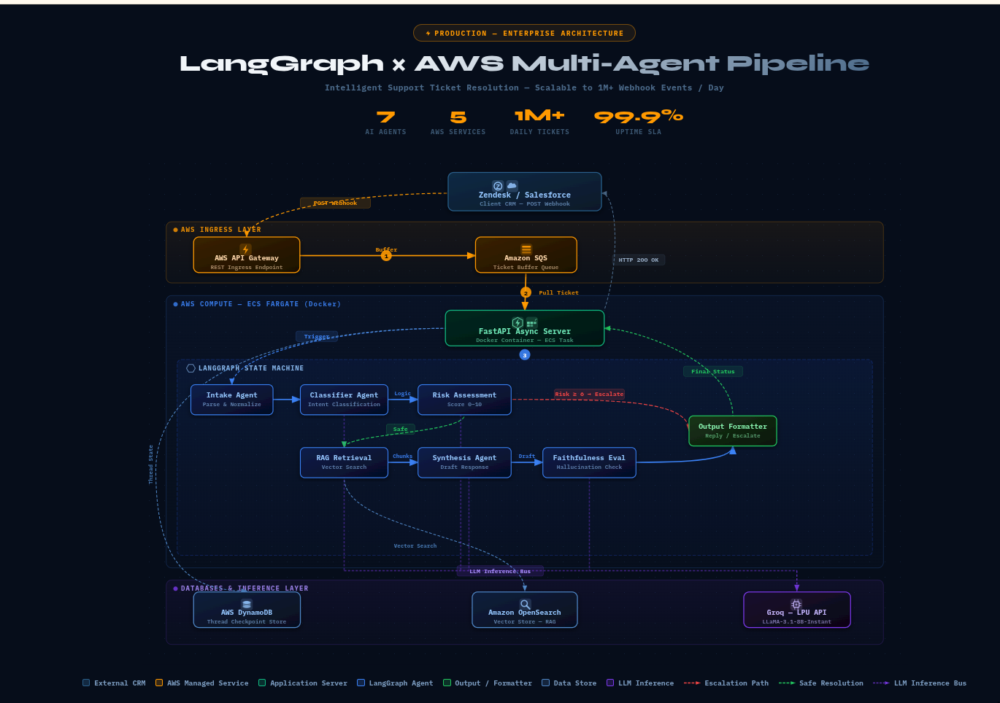

<br/>
<p align="center">
  
</p>

<h1 align="center">Orchestrate '26: Enterprise Multi-Agent AI Triage System</h1>

<p align="center">
  <strong>Production-Ready LangGraph Triage Architecture for Tier-1 Support Automation</strong>
</p>

<p align="center">
  
  
  
  
  
  
</p>

---

**GitHub Repository:** [https://github.com/BHUVANESH-SSN/hackerrank-orchestrate-ai.git](https://github.com/BHUVANESH-SSN/hackerrank-orchestrate-ai.git)

---

## Overview

This repository contains an Enterprise-grade Multi-Agent System designed for accurately triaging, resolving, and routing Tier-1 Customer Support tickets with zero hallucinations. Built for the HackerRank Orchestrate May '26 Hackathon, this pipeline safely processes queries across the HackerRank, Claude, and Visa domains.

Unlike standard LLM chains, this architecture uses a LangGraph state machine to force deterministic safety checks. The system routes incoming messages, retrieves documents via a highly-tuned Hybrid RAG pipeline, and employs a rigorous dual-model defense system to catch AI hallucinations before they ever reach the user.

---

## System Design and Architecture



This system is designed as an Autonomous Support Middleware capable of integrating with existing support channels such as Zendesk, Salesforce, or direct email. The core design philosophy centers on Safety-First Agentic RAG. A state-machine approach ensures that every ticket passes through a rigorous sequence of validation gates before a response is generated.

---


## Architectural Vision

This system is designed as an Autonomous Support Middleware capable of integrating with existing support channels such as Zendesk, Salesforce, or direct email. The core design philosophy centers on Safety-First Agentic RAG. A state-machine approach ensures that every ticket passes through a rigorous sequence of validation gates—Classification, Risk Assessment, Hybrid Retrieval, and Faithfulness Verification—before a response is generated.

---

## The Agentic Ecosystem (LangGraph State Machine)

The system is orchestrated using LangGraph, treating the triage process as a directed graph where each node represents a specialized agent. This enables conditional branching and deterministic error handling.

### 1. Intake and Normalization Agent
- **Role:** Data Cleaning.
- **Function:** Sanitizes the raw ticket body, removes metadata noise, and extracts key entities. It normalizes input into a standard schema for all subsequent processing.

### 2. Multi-Domain Classifier Agent
- **Role:** Intelligent Routing.
- **Function:** Utilizes Llama-3.1-8B for low-latency intent detection. It maps tickets to one of three domains: HackerRank, Claude, or Visa. It further identifies specific Product Areas (e.g., hr_billing, visa_disputes) to narrow the RAG engine's search parameters.

### 3. Risk and Safety Agent
- **Role:** Policy Enforcement.
- **Function:** A deterministic engine scanning for high-severity triggers:
  - **PII Leakage:** Detects sensitive information such as credit card numbers or order IDs.
  - **Security Vulnerabilities:** Identifies reports of bugs or exploits.
  - **Legal/Fraud:** Flags threats or fraud reports.
- **Outcome:** High-risk tickets are immediately diverted to human specialists, bypassing LLM synthesis to ensure data security.

### 4. Hybrid Retrieval Agent
- **Role:** Context Provision.
- **Function:** Implements a multi-stage Hybrid Search pipeline:
  - **Dense Search:** ChromaDB with all-MiniLM-L6-v2 for semantic context.
  - **Sparse Search:** BM25 for exact keyword matching.
  - **Cross-Encoder Reranking:** Top 20 candidates are reranked using ms-marco-MiniLM-L-6-v2 to select the most relevant top_k=6 chunks.

### 5. Synthesis Agent (The Maker)
- **Role:** Professional Response Generation.
- **Function:** Uses GPT-OSS-120B to draft responses. It is strictly constrained by a system prompt to utilize only the provided context. If context is absent, it returns an INSUFFICIENT_CONTEXT status.

### 6. Faithfulness Agent (The Checker)
- **Role:** Quality Control and Validation.
- **Function:** Performs a self-correction check by comparing the Maker's response against the original source documents. If unverified claims or hallucinations are detected, the ticket is flagged and escalated.

---

## Hybrid RAG System Design

The RAG system prioritizes precision over recall. In a support context, it is preferable to escalate a ticket than to provide an incorrect answer.

1.  **Preprocessing:** Documents are split into 500-token chunks with a 50-token overlap to maintain context.
2.  **Multi-Stage Retrieval:**
    - **Stage 1 (Recall):** BM25 and Vector Search retrieve a broad pool of candidates.
    - **Stage 2 (Refinement):** The Cross-Encoder ensures that nuanced queries are correctly matched to the documentation.
3.  **Domain Isolation:** The retriever only searches within the namespace identified by the Classifier, preventing cross-domain errors.

---

## Technical Stack

- **Orchestration:** LangGraph
- **LLM Inference:** Groq LPU (Llama 3.1 & GPT-OSS-120B)
- **Vector Database:** ChromaDB
- **Embeddings:** HuggingFace all-MiniLM-L6-v2
- **Reranker:** HuggingFace ms-marco-MiniLM-L-6-v2
- **API Framework:** FastAPI

---

## Evaluator Guide: System Execution

### 1. Prerequisites and Installation

Ensure Python 3.12+ is installed.

```bash
# Navigate to the code directory
cd code

# Create and activate a virtual environment
python -m venv venv
source venv/bin/activate

# Install required dependencies
pip install -r requirements.txt
```

### 2. Configuration

Create a `.env` file in the `code/` directory:

```env
GROQ_API_KEY=your_groq_api_key_here
```

### 3. Knowledge Base Initialization

```bash
python scripts/build_corpus.py
```

### 4. Running the Batch Evaluation

```bash
python batch.py
```

### 5. Interactive UI (Optional)

```bash
python main.py
```

---

<p align="center">
  <i>Developed for the HackerRank Orchestrate '26 Competition. Focused on Safety, Grounding, and Professional Reliability.</i>
</p>
